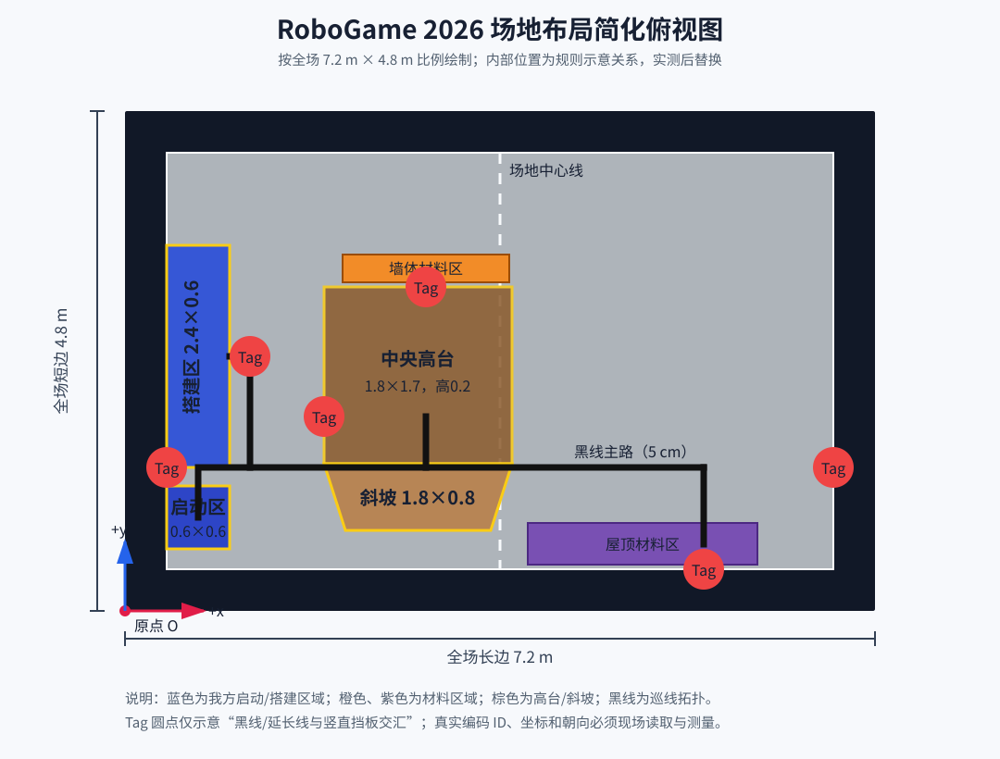

# RoboGame 2026 场地布局与现场测量大白话指南

> 这份指南解决两个问题：第一，先把场地“看懂”；第二，到现场知道卷尺到底量哪里。  
> 不需要从零重画场地。规则已经写明的尺寸直接采用，只补测规则没有给出的坐标。

---

## 一、先用一句话认识场地

整块场地是一个 **7.2 m × 4.8 m** 的长方形，四周有 **0.4 m 宽、0.4 m 高的黑色边界**。场地从中心完全对称，双方各跑自己的半场。

每个半场都可以理解成下面这条工作路线：

```text
启动区
  ↓ 沿黑线出发
黑线主路和几个路口
  ├── 去墙体材料区，取橙色方块
  ├── 去屋顶材料区，取紫色方块
  └── 去搭建区，放置方块

中央高台和斜坡位于场地中部附近
黑色竖直挡板上的 1～6 号视觉标签位于黑线或其延长线与挡板相交的位置
```

机器人不是在一张完全空旷的地板上自由乱跑，而是主要顺着黑线，在“启动区、材料区、搭建区”之间移动。视觉标签贴在现场黑色竖直挡板朝通道的一面，相当于固定路标，用来修正轮子累计产生的位置误差。

---

## 二、简化俯视图怎么读

下面不是精确施工图，只表示各部分的关系。现场方向可能旋转或镜像，但区域之间的关系不变。图框严格按全场 `7.2:4.8` 的比例绘制，因此不会再受 Markdown 字体宽度影响而变形。



图中的 `Tag` 圆点只表示标签位于黑线或其延长线与挡板交汇处，不代表已经知道编码 ID 与现场每块标签的对应关系，更不代表精确坐标。现场照片已经确认标签贴在黑色竖直挡板朝机器人通道的一面。标签尺寸都是 **15 cm × 15 cm**，上边缘离地 **40 cm**，因此标签中心理论高度是 **32.5 cm**。

### 规则已经确定，不用重新测的尺寸

| 项目 | 规则尺寸 |
|---|---:|
| 整个场地 | 7.2 m × 4.8 m |
| 外围黑色边界 | 宽 0.4 m、高 0.4 m |
| 黑色巡线 | 宽 0.05 m，允许 ±5% |
| 启动区 | 0.6 m × 0.6 m |
| 搭建区 | 2.4 m × 0.6 m，高 0.1 m |
| 中央高台 | 1.8 m × 1.7 m，高 0.2 m |
| 斜坡 | 1.8 m × 0.8 m，约 14° |
| 墙体材料区 | 1.8 m × 0.3 m |
| 屋顶材料区 | 2.2 m × 0.4 m |
| 视觉标签 | 0.15 m × 0.15 m，上沿高 0.4 m |

这些尺寸可以现场快速核对，但不应该占用主要测量时间。真正缺的是它们在统一坐标系里的位置。

---

## 三、什么叫“测坐标”

我们统一选场地外沿的一个角当作原点 `O=(0,0)`。**注意：x 是沿 4.8 m 短边，y 是沿 7.2 m 长边（指向对方半场）**，和代码/场地图配置一致：

```text
             +y（沿 7.2 m 长边，指向对方半场）
              ↑
              │
              │
原点 O ───────└────────→ +x（沿 4.8 m 短边）
```

以后任何一个点都写成 `(x, y)`：

- `x`：这个点沿短边方向离原点有多远（全场最大 4.8 m）；
- `y`：这个点沿长边方向离原点有多远（全场最大 7.2 m）；
- 两个距离都必须沿地面水平量，不要斜着拉卷尺；
- 单位统一用米，例如 185 cm 记作 `1.85 m`。

### 最容易操作的量法

假设要量一个黑线拐角 P：

1. 从 P 向 `x` 轴方向作垂线，量出 `y`；
2. 从 P 向 `y` 轴方向作垂线，量出 `x`；
3. 写成 `P=(x,y)`；
4. 在照片里同时拍到 P、卷尺和参照边；
5. 不要直接从原点斜着量到 P，那只能得到斜边长度，不是坐标。

如果现场只有一把卷尺，可以先沿边界量出投影位置，用胶带做临时记号，再量另一方向。

---

## 四、到现场具体测什么

### 第 0 步：先固定坐标系，别急着量

到场后的第一张照片必须包含：选定的原点、`+x` 方向、`+y` 方向和我方半场。

记录：

| 项目 | 填写 |
|---|---|
| 原点选在哪个角 | |
| +x 朝向哪里 | |
| +y 朝向哪里 | |
| 我方颜色/半场 | |
| 场地实际长、宽 | |
| 照片文件名 | |

如果裁判规定了正式坐标方向，就采用裁判规定；否则使用本指南坐标。后续所有数据只能使用同一个原点。

### 第 1 步：测黑线骨架

#### 要测哪些点

只测这四类点：

1. 黑线从启动区出来的起点；
2. 每个拐角；
3. 每个 T 字、十字交叉口的中心；
4. 黑线碰到墙体、材料区或搭建区的终点。

**直线中间不需要每 0.5 m 测一个点。** 两端坐标足以表示一条直线。只有现场黑线明显弯曲时，才在弯曲处每 0.2～0.5 m 补点。

建议按机器人实际行驶顺序编号：`L01、L02、L03……`。

| 点号 | 点的类型 | x (m) | y (m) | 连接到哪些点 | 照片 |
|---|---|---:|---:|---|---|
| L01 | 启动区出线点 | | | L02 | |
| L02 | 第一个路口 | | | | |
| L03 | 拐角/路口 | | | | |
| L04 | 材料区终点 | | | | |
| L05 | 搭建区终点 | | | | |
| … | | | | | |

#### 还要记清楚路口往哪走

坐标只说明点在哪里，还要记录每条支路通向哪里。例如：

```text
L02 左转 → 搭建区
L02 直行 → 屋顶材料区
L03 右转 → 墙体材料区
```

这部分决定状态机在交叉口应该直行、左转还是右转。

### 第 2 步：测真正需要停车的点

区域中心不一定等于机器人最佳停车点。需要分别测“区域位置”和“车该停哪里”。

#### 必测停车点

| 编号 | 停车点 | x (m) | y (m) | 车头朝向 | 为什么停这里 |
|---|---|---:|---:|---:|---|
| W01 | 启动姿态中心 | | | | 开赛初始位姿 |
| W02 | 墙体材料抓取位 | | | | 机械臂能抓到橙块 |
| W03 | 屋顶材料抓取位 | | | | 机械臂能抓到紫块 |
| W04 | 搭建放置位 | | | | 机械臂能放到有效区 |
| W05 | 搭建后撤退位 | | | | 放置后安全退开 |
| W06 | 坡前等待位 | | | | 上坡前减速 |
| W07 | 坡后恢复位 | | | | 离坡后恢复普通控制 |

车头朝向现场先用 `0°、90°、180°、270°` 记录：

- 朝 `+x`：0°；
- 朝 `+y`：90°；
- 朝 `-x`：180°；
- 朝 `-y`：270°。

斜向时再记录实际角度。不要急着换成弧度，回到电脑后统一转换。

### 第 3 步：测 1～6 号视觉标签

#### 先确认它到底是不是 AprilTag

每个标签都拍一张正面近照。照片必须能看清完整边框和编号。记录它属于：

- 黑白方格码；
- 纯数字牌；
- 其他图案。

这一项非常重要：如果现场是数字牌，现有 AprilTag 检测程序不能直接使用。

#### 每个标签测四个量

先用检测程序读取黑白编码中的真实 ID，不要根据它在示意图里的位置猜编号。然后测：

1. 标签中心正下方地面点的 `x`；
2. 标签中心正下方地面点的 `y`；
3. 标签中心离地高度 `z`；
4. 标签正面朝向。

“正面朝向”就是垂直离开标签正面、指向机器人通道的方向。现场只需拍正面路线照并记角度，不需要判断它属于“外围墙、上墙、下墙、左墙或右墙”。

| ID | 样式 | x (m) | y (m) | 中心高 z (m) | 正面朝向 | 近照 |
|---:|---|---:|---:|---:|---|---|
| 1 | | | | | | |
| 2 | | | | | | |
| 3 | | | | | | |
| 4 | | | | | | |
| 5 | | | | | | |
| 6 | | | | | | |

高度理论值是 `0.325 m`。每个标签只需快速核对一次；如果全部相同，可以注明“6 个一致”。

### 第 4 步：测坡道和高台的控制边界

规则已经给坡道大小和角度，但程序更关心“从哪里开始减速、到哪里恢复”。

需要记录：

| 点/线 | x (m) | y (m) | 说明 |
|---|---:|---:|---|
| R01 坡道下沿左端 | | | 坡道真正开始处 |
| R02 坡道下沿右端 | | | |
| R03 坡道上沿左端 | | | 高台开始处 |
| R04 坡道上沿右端 | | | |
| R05 坡前减速线 | | | 建议比下沿提前一个车身 |
| R06 离坡恢复线 | | | 完全离开坡道后的位置 |

还要测车实际上坡时 IMU 的 `pitch`：平地、刚上坡、坡中、刚下坡各记录一次。这样程序才能同时用“地图位置”和“车身倾角”判断是否进入坡道状态。

### 第 5 步：测灰度巡线传感器

这不是量场地坐标，而是给传感器找黑白分界。

1. 车静止放在白/灰地面上，采集 100 帧八路原始值；
2. 车静止放在黑线正中，采集 100 帧；
3. 车分别向左、向右横移，让黑线经过八个通道，每个位置记录一次；
4. 灯光较亮和较暗时各重复一组；
5. 每一路阈值先取该路“黑线均值”和“地面均值”的中间值，不要八路共用一个拍脑袋阈值。

| 通道 | 地面均值 | 黑线均值 | 初始阈值 | 黑/白方向是否反了 |
|---:|---:|---:|---:|---|
| 0 | | | | |
| 1 | | | | |
| 2 | | | | |
| 3 | | | | |
| 4 | | | | |
| 5 | | | | |
| 6 | | | | |
| 7 | | | | |

### 第 6 步：测相机和机器人本体关系

视觉标签算出的是“相机在哪里”，程序最终要知道“机器人中心在哪里”，所以还要量相机外参。

以机器人底盘旋转中心为 `(0,0,0)`，量：

| 项目 | 数值 |
|---|---:|
| 相机在机器人中心前后位置 x (m) | |
| 相机在机器人中心左右位置 y (m) | |
| 相机镜头高度 z (m) | |
| 相机向左/向右偏角 yaw (°) | |
| 相机向上/向下俯仰 pitch (°) | |

同时量车身外形：总长、总宽、旋转中心到车头距离。否则地图上“车中心没越界”时，车壳或机械臂仍可能撞墙。

---

## 五、什么时候改变程序状态

把状态变化理解成“谁最适合接管方向盘”。

| 情况 | 使用状态 | 大白话解释 |
|---|---|---|
| 离目标还远，暂时看不到黑线 | `WAYPOINT` | 用里程计和 IMU先走到路线附近 |
| 到了指定巡线路段，连续看到黑线 | `LINE_FOLLOW` | 灰度传感器接管左右纠偏 |
| 到了预期标签附近，识别到正确 ID | `TAG_DOCK` | 减速，用标签修正位置并精确靠近 |
| 到坡前或车身开始倾斜 | `RAMP` | 限速，防止冲坡和轮子打滑 |
| 到材料抓取停车点且姿态稳定 | `PICK` | 停车后才能让机械机构抓取 |
| 到搭建停车点且姿态稳定 | `PLACE` | 停车后执行放置 |
| 放置动作明确完成 | `RETREAT` | 先后退离开建筑，再判断任务完成 |
| 急停、通信断开或位置已经不可信 | `STOP` | 其他状态全部让路，立即停车 |

### 建议使用“连续确认”，不要看一帧就切状态

- 黑线连续出现 3～5 帧，再切入巡线；
- 标签 ID 连续正确 3 帧以上，再用它修正定位；
- 到达停车点后，位置和角度连续稳定 0.3～0.5 秒，再动作；
- 黑线短暂丢失不要立刻乱转，连续丢失达到门限后先停车，再低速搜索；
- 标签识别成错误 ID 时不切状态，只记录并继续当前动作。

具体帧数和稳定时间是首版建议，需要根据相机帧率和车速实测调整。

---

## 六、现场最省时间的执行顺序

如果只有 60～90 分钟，按下面顺序做：

1. **5 分钟：**定原点、方向、我方半场，拍总览；
2. **20 分钟：**测黑线起点、拐角、路口和终点；
3. **15 分钟：**测 6 个标签，逐个拍正面近照；
4. **15 分钟：**测 5～7 个实际停车点及车头朝向；
5. **10 分钟：**测坡道起止边和减速位置；
6. **10 分钟：**量相机外参和车身尺寸；
7. **有车有电再做：**灰度、IMU、停车误差和标签识别测试。

如果时间不够，优先保住：**坐标系 → 黑线路口 → 标签 → 抓取/搭建停车点**。规则已经给出的整体尺寸可以不重复精测。

---

## 七、拍照要求

照片不是为了好看，而是为了回来后能复核数据。

必须拍：

- 场地全景，标出原点和两个坐标轴；
- 每个黑线路口一张俯视照片；
- 1～6 号标签各一张正面近照、一张带周围环境的远照；
- 每个停车点放一个明显标记后拍照；
- 坡道侧面和俯视照片；
- 相机在车上的正面、侧面安装照片；
- 灰度传感器相对车头、黑线的安装位置照片。

照片名直接按数据编号，例如 `L03_overview.jpg`、`TAG04_close.jpg`、`W02_pick_pose.jpg`，不要回来后面对几十张 `IMG_1234.jpg` 猜内容。

---

## 八、现场完成的判断标准

离开场地前逐项确认：

- [ ] 所有数据使用同一个原点和方向；
- [ ] 黑线每个起点、终点、拐角和路口都有坐标；
- [ ] 记录了每个路口通向哪个任务区；
- [ ] 6 个标签都有 ID、坐标、朝向和近照；
- [ ] 抓取位、搭建位和撤退位都有位置与车头朝向；
- [ ] 坡道上下沿有坐标；
- [ ] 相机外参和车身长宽已量；
- [ ] 每项无法测量的内容都写明原因，而不是留空；
- [ ] 随机抽两个点重新测量，前后差值最好不超过 1 cm；
- [ ] 数据和照片至少备份两份。

完成这些，就已经足够把一般场地图升级成可用于实车导航的测量地图。之后只是把表格数据回填到 `field_layout.yaml`，不需要重新设计定位、巡线或状态机。

---

## 九、回填时分别进入哪里

| 现场数据 | 回填位置/用途 |
|---|---|
| 场地、区域、黑线和停车点坐标 | `ros2_ws/src/robogame_bringup/config/field_layout.yaml` |
| 标签 ID、位置、高度、朝向 | 标签地图配置，供定位融合使用 |
| 黑/白灰度和各通道阈值 | 巡线节点参数 |
| 相机外参 | 相机到机器人坐标变换 |
| 坡道边界和 pitch | 坡道状态切换参数 |
| 停车误差 | 到点容差、减速距离和稳定时间 |

回填时保留原始测量记录，不要只留下最终参数。以后发现路线偏了，才能判断是测量错误、坐标变换错误，还是控制器误差。
